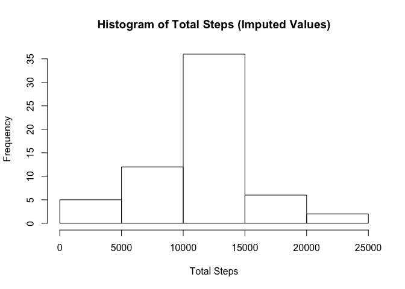

# Reproducible Research: Peer Assessment 1


### Loading and preprocessing the data
1. Load the data

```r
    d <- read.csv("activity.csv", stringsAsFactors = FALSE)
```


2. Transform data (create a grouping by date and a grouping by interval)

```r
    g <- group_by(d, date)
    i <- group_by(d, interval)
```

### What is mean total number of steps taken per day?
1. Calculate the total number of steps per day

```r
    g <- summarize(g, sum(steps, na.rm = TRUE))
    names(g) <- c("date", "total_steps")
```


2. Make a histogram of the total number of steps per day

```r
    hist(g$total_steps, main = "Histogram of Total Steps", xlab = "Total Steps")
```

 


3. Calculate the mean and median of the total number of steps per day

```r
    ts_mean <- as.data.frame(mean(g$total_steps))
    names(ts_mean) <- "Mean"
    ts_median <- as.data.frame(median(g$total_steps))
    names(ts_median) <- "Median"
    ts_df <- cbind(ts_mean,ts_median)
    rownames(ts_df) <- "Total Steps per Day"
    ts_df <- xtable(ts_df)
    print(ts_df, type="html")
```

<!-- html table generated in R 3.2.1 by xtable 1.8-0 package -->
<!-- Sun Dec 20 09:50:34 2015 -->
<table border=1>
<tr> <th>  </th> <th> Mean </th> <th> Median </th>  </tr>
  <tr> <td align="right"> Total Steps per Day </td> <td align="right"> 9354.23 </td> <td align="right"> 10395 </td> </tr>
   </table>


## What is the average daily activity pattern?
1. Make a time series plot of the average steps per five min interval

```r
    i <- summarize(i, mean(steps, na.rm=TRUE))
    names(i) <- c("interval","avg_steps")
    plot(i$interval, i$avg_steps, type="l", xlab = "5-min Interval", ylab = "Avg Steps", main = "Avg Steps per Interval")
```

 


2. Which interval has the max number of steps?

```r
    ts_df <- subset(i, i$avg_steps==max(i$avg_steps))
    names(ts_df) <- c("Interval", "Avg Steps")
    rownames(ts_df) <- "Interval with Max Steps"
    ts_df <- xtable(ts_df)
    print(ts_df, type="html")
```

<!-- html table generated in R 3.2.1 by xtable 1.8-0 package -->
<!-- Sun Dec 20 09:50:34 2015 -->
<table border=1>
<tr> <th>  </th> <th> Interval </th> <th> Avg Steps </th>  </tr>
  <tr> <td align="right"> Interval with Max Steps </td> <td align="right"> 835 </td> <td align="right"> 206.17 </td> </tr>
   </table>


### Imputing missing values
1. Calculate the total number of missing values in the dataset

```r
    ts_df <- as.data.frame(sum(is.na(d$steps)))
    names(ts_df) <- "Count"
    rownames(ts_df) <- "Total NAs"
    ts_df <- xtable(ts_df)
    print(ts_df, type="html")
```

<!-- html table generated in R 3.2.1 by xtable 1.8-0 package -->
<!-- Sun Dec 20 09:50:34 2015 -->
<table border=1>
<tr> <th>  </th> <th> Count </th>  </tr>
  <tr> <td align="right"> Total NAs </td> <td align="right"> 2304 </td> </tr>
   </table>
###

2. Devise a strategy for filling in missing values

   * For each missing value, use the average for that interval across all days
   * Loop through each row of the data frame (n).  If the steps value (n\$steps) is NA, assign the avg steps (i\$avg_steps) from the average per interval data frame (i) for the corresponding interval (i.e. i\$interval[idx]==n\$interval[idx])
   
3. Create a new dataset with the imputed values

```r
    n <- d
    # The single ifelse line seems to work, but I can't quite understand 
    #    how the proper interval from i is determined
    #
    # n$steps <- ifelse(is.na(n$steps), i$avg_steps, n$steps)
    #
    # Going with what I can understand :)
    for (idx in 1:nrow(n)) {
        if (is.na(n$steps[idx])) {
            n$steps[idx] <- i[i$interval==n$interval[idx],]$avg_steps
        } 
    }
```


4. Make a histogram of the total number of steps per day with the new dataset

```r
    ng <- group_by(n, date)
    ng <- summarize(ng, sum(steps))
    names(ng) <- c("date", "total_steps")
    hist(ng$total_steps, main = "Histogram of Total Steps (Imputed Values)", xlab = "Total Steps") 
```

 

   * Calculate the mean and median using the new dataset.
   
   * The mean and median are higher than the original dataset.  Because there are eight full days with missing values, total steps for that day is the mean for all days and the median ends up being the same as the mean.

```r
    #mean(ng$total_steps)
    #median(ng$total_steps)
    ts_mean <- as.data.frame(mean(ng$total_steps))
    names(ts_mean) <- "Mean"
    ts_median <- as.data.frame(median(ng$total_steps))
    names(ts_median) <- "Median"
    ts_df <- cbind(ts_mean,ts_median)
    rownames(ts_df) <- "Total Steps per Day"
    ts_df <- xtable(ts_df)
    print(ts_df, type="html")
```

<!-- html table generated in R 3.2.1 by xtable 1.8-0 package -->
<!-- Sun Dec 20 09:50:34 2015 -->
<table border=1>
<tr> <th>  </th> <th> Mean </th> <th> Median </th>  </tr>
  <tr> <td align="right"> Total Steps per Day </td> <td align="right"> 10766.19 </td> <td align="right"> 10766.19 </td> </tr>
   </table>
   
   
### Are there differences in activity patterns between weekdays and weekends?
1. Using the dataset with imputed missing values (n), create a factor variable indicating weekend vs weekday

```r
    # assign a number for day of week (0=Sunday, 6=Saturday)
    n$dow <- as.POSIXlt(n$date)$wday
    # For weekdays (dow is 1 through 5), assign a level of TRUE and a label of "weekday"
    # For weekend days (dow is 0 or 6), assign a level of FALSE and a label of "weekend"
    n$dowf <- factor(n$dow %in% 1:5, levels=c(FALSE,TRUE), labels = c("weekend","weekday"))
```


2. Make a panel plot containing a time series plot of the 5-minute interval and the average number of steps taken, averaged across all weekday days or weekend days.

```r
    # calculate average steps per interval with 'new' dataset
    nw <- group_by(n, dowf, interval)
    nw <- summarize(nw, mean(steps))
    names(nw) <- c("dowf","interval","avg_steps")
    
    # Create a panel plot showing weekend vs weekday
    p <- ggplot(nw, aes(x=interval, y=avg_steps)) 
    p <- p + geom_line() 
    p <- p + facet_wrap(~dowf, ncol=1)
    p <- p + labs(title="Avg Steps per Interval (Weekday vs Weekend)")
    p <- p + labs(x = "5-min Interval", y = "Avg Steps")
    print(p)
```

 
