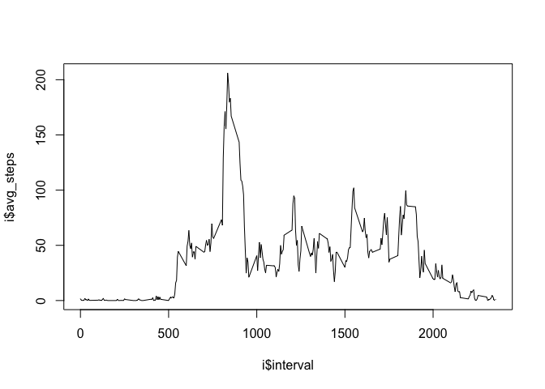

# Reproducible Research: Peer Assessment 1


## Loading and preprocessing the data


## What is mean total number of steps taken per day?

```r
    g <- group_by(d, date)
    g <- summarize(g, sum(steps, na.rm = TRUE))
    names(g) <- c("date", "total_steps")
```

### Histogram

```r
    hist(g$total_steps)
```

 

### Mean and Median

```r
    mean(g$total_steps)
```

```
## [1] 9354.23
```

```r
    median(g$total_steps)
```

```
## [1] 10395
```

## What is the average daily activity pattern?
### Average steps per five min interval

```r
    i <- group_by(d, interval)
    i <- summarize(i, mean(steps, na.rm=TRUE))
    names(i) <- c("interval","avg_steps")
    plot(i$interval, i$avg_steps, type="l")
```

 

### Interval having max avg steps

```r
    subset(i, i$avg_steps==max(i$avg_steps))
```

```
## Source: local data frame [1 x 2]
## 
##   interval avg_steps
##      (int)     (dbl)
## 1      835  206.1698
```

## Imputing missing values


## Are there differences in activity patterns between weekdays and weekends?
